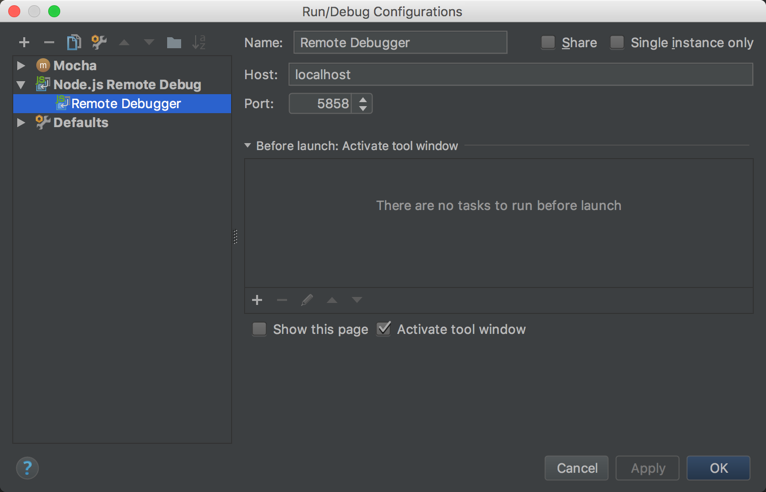

# boilerplate-typescript-rest-docker [](https://travis-ci.org/stefanwalther/boilerplate-typescript-rest-docker)

> How to use TypeScript & Docker building a REST service with debugging enabled (e.g. WebStorm or VSCode).


## Installation

```sh
# Clone the directory
$ git clone https://github.com/stefanwalther/boilerplate-typescript-rest-docker

# Install the local dependencies
# - Not necessary if you just want to use/test the docker containers

$ npm install
```

## The Development Workflow

The development environment contains the following:  

- A docker container called `rest-service` containing the REST server as defined in `./src`.  
- The REST services is exposed at `http://localhost:8000`.  
- Watcher (using [nodemon]()http://nodemon.io/ ): As soon as you make changes to the `./src` folder, the TypeScript files will be transpiled again and the server restarted.
  - So you can run your integration tests against your local `rest-service` container, which is after any change immediately up to date.
- Remote debugging enabled through port `5858`.  

## Run the Development Environment

```sh
$ docker-compose --f=./docker/docker-compose.dev.yml up
```

This will give you all of the above described.

## Debugging in WebStorm

Assuming that rest-service itself could rely on other services it makes sense just to spin up the development environment:

```sh
$ docker-compose --f=./docker/docker-compose.dev.yml up
```

So you can run your integration tests against http://localhost8000
The `rest-service` will be updated every time you make updates to the `./src` folder.

If you want to debug the rest-service (e.g. when hitting integration tests against the `rest-service`) this is the configuration being used in this example:

*Create a remote debugger* 

- `./docker/docker-compose.dev.yml` opens the port `5858` for the debugger, so let's connect to it:



### Running Unit Tests

Running the unit test in this scenario is straight-forward, just configure WebStorm as follows.
(This will not use the container, just directly test the transpiled TypeScript code).


Most of the settings should be default, except:

- *Extra mocha options:* `--require ./test/mocha.conf.js`
- *Test file patterns:* `./test/unit/**/*.spec.ts`

### Hit the Debugger (That's the trick!!!)


## Debugging in VSCode

(TBD)

## Continuous Integration

To simulate the Continuous Integration script run the following

```sh
$ bash ./docker/docker-ci.sh
```


